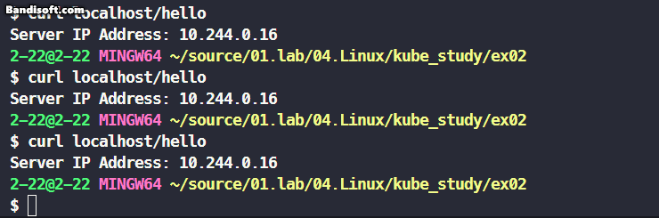

<h1>minikube 로드밸런싱 실습</h1>

<h2>1. Docker 빌드 및 Docker Hub로 Push</h2>
<ol>
    <li>먼저 Docker가 설치되고 실행 중인지 확인합니다.</li>
    <li>아래 명령어로 Docker 이미지를 빌드합니다:
        <pre><code>docker build -t 당신의-dockerhub-아이디/helloworld-app .</code></pre>
    </li>
    <li>이미지가 빌드된 후, Docker Hub에 로그인합니다:
        <pre><code>docker login</code></pre>
    </li>
    <li>Docker 이미지를 Docker Hub에 푸시합니다:
        <pre><code>docker push 당신의-dockerhub-아이디/helloworld-app</code></pre>
    </li>
</ol>

<h2>2. Minikube에 배포</h2>

Minikube가 설치되고 실행 중인지 확인합니다. Minikube를 시작하려면 다음 명령어를 사용하세요:

<pre><code>minikube start</code></pre>

<h3>2.1 디플로이먼트 생성</h3>

Minikube에 디플로이먼트를 생성하기 위해 <code>images</code> 폴더에 제공된 <code>deployment.yml</code> 파일을 사용할 수 있습니다. 예시는 다음과 같습니다:

<pre><code>
apiVersion: apps/v1
kind: Deployment
metadata:
  name: myapp
spec:
  replicas: 3
  selector:
    matchLabels:
      app: myapp
  template:
    metadata:
      labels:
        app: myapp
    spec:
      containers:
      - name: myapp
        image: cajhyung/myapp:0.1
        resources:
          limits:
            memory: "128Mi"
            cpu: "500m"
        ports:
        - containerPort: 8080
</code></pre>

다음 명령어로 디플로이먼트를 적용합니다:

<pre><code>kubectl apply -f deployment.yml</code></pre>

<h2>3. 로드밸런서 서비스 생성</h2>

서비스를 생성하기 위해 <code>service.yml</code> 파일을 사용합니다. 예시는 다음과 같습니다:

<pre><code>
apiVersion: v1
kind: Service
metadata:
  name: myapp
spec:
  selector:
    app: myapp
  ports:
  - port: 80
    targetPort: 8080
  type: LoadBalancer
</code></pre>

서비스를 적용하려면 아래 명령어를 사용하세요:

<pre><code>kubectl apply -f service.yml</code></pre>

## 트러블슈팅

### minikube 이미지 인식

minikube는 도커 컨테이너로서 실행되고 있습니다.

도커 컨테이너를 실행하고 있는 호스트 머신에서 `docker build` 를 수행해서 만든 이미지는 호스트 머신에서만 존재합니다.

그러므로, 컨테이너로 실행되고 있는 minikube가 호스트 머신의 도커 이미지를 알 수 없으니 docker hub 사이트같은 원격지에 업로드합니다.

이제 minikube는 원격지의 이미지를 다운로드하여 디플로이먼트를 실행할 수 있습니다.
